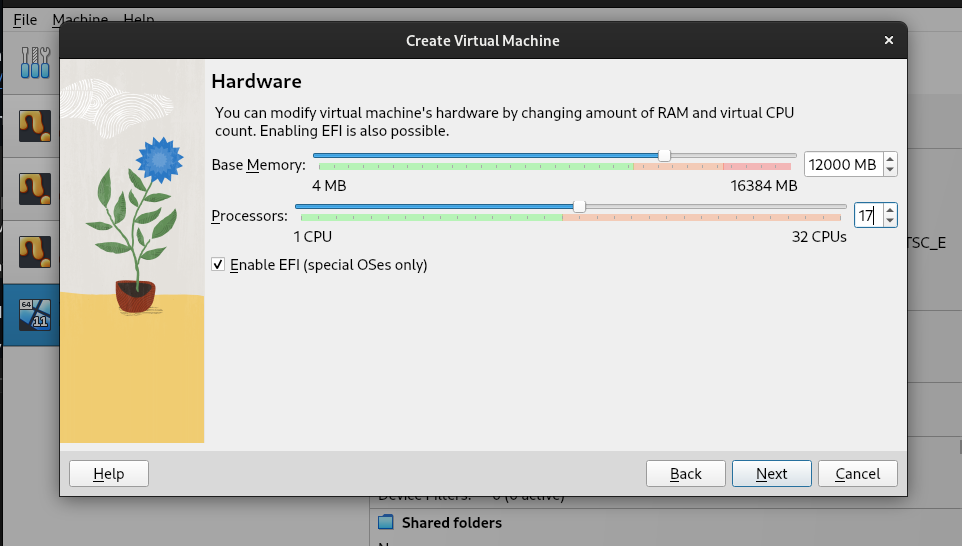
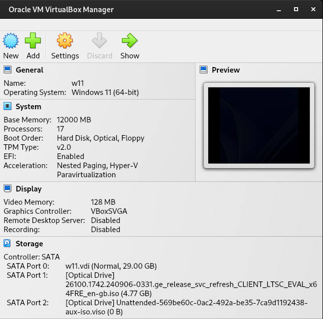
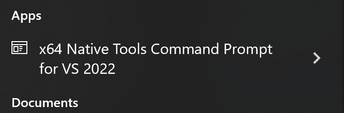
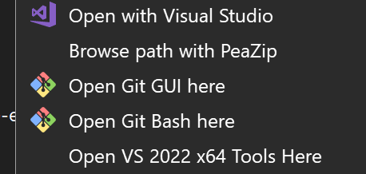
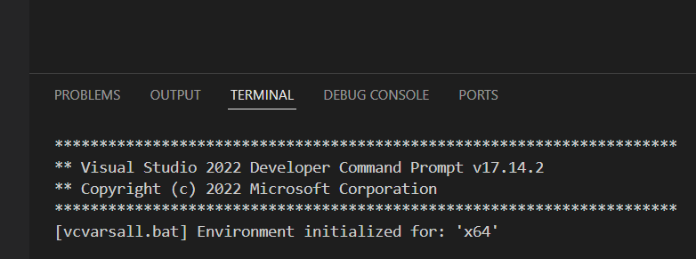
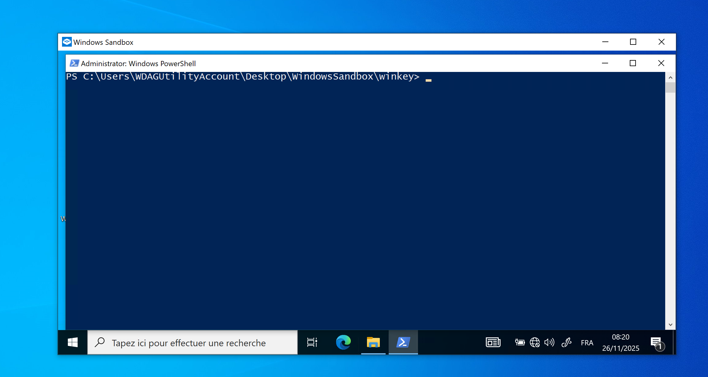

# windows-cpp-environment

## Introduction

This README explains how to set up a Windows development environment for C and C++ projects. It covers installing Visual Studio Build Tools, configuring `nmake` and `cl`, setting up Visual Studio Code to use the proper environment, customizing PowerShell with useful aliases, and creating a safe sandbox environment for testing programs in isolation. The instructions are suitable for software development and research scenarios where you want to avoid affecting your main system.

### Table of Contents

  - [Installing a Windows 11 Virtual Machine](#installing-a-windows-11-virtual-machine-virtualbox-no-external-disk)
  - [Setting up Windows](#setting-up-windows)  
  - [Install Build Tools (CL, NMAKE)](#install-build-tools-cl-nmake)  
  - [Add right-click “Open VS Build Tools here”](#add-right-click-open-vs-build-tools-here)  
  - [How to use `nmake` in VS Code](#how-to-use-nmake-in-vs-code)  
  - [Differences Between `nmake` and `make`](#differences-between-nmake-and-make)
  - [Setting up cmd.exe](#setting-up-cmdexe)
  - [Setting up PowerShell](#setting-up-powershell)  
  - [Setting up a Windows Sandbox for Safe Testing](#setting-up-a-windows-sandbox-for-safe-testing)  
  - [Launching Windows Sandbox](#launching-windows-sandbox)  
  - [Windows Sandbox configuration (`WindowsSandboxConfigFile.wsb`)](#windows-sandbox-configuration-windowssandboxconfigfilewsb)  
  - [Startup initialization script (`setup-lang.ps1`, `mute-audio.ps1`)](#startup-initialization-scripts-setup-langps1-mute-audiops1)

---

## Installing a Windows 11 Virtual Machine (VirtualBox, no external disk)

This section explains how to install a Windows 11 virtual machine for testing purposes without any external disk.
The instructions are written with [42 school](https://42.fr/en/homepage/) environments in mind (specific paths and storage constraints), but they can be adapted to any system by changing paths and resource limits.

### Download Windows 11 ISO

1. Go to the official Microsoft page:
   [https://info.microsoft.com/ww-landing-windows-11-enterprise.html](https://info.microsoft.com/ww-landing-windows-11-enterprise.html)

2. Fill in the form and click **“Download now”**.

3. Download the **Windows 11 Enterprise ISO**.

---

### Create the Virtual Machine (VirtualBox)

1. Open **VirtualBox** and click **New**.
2. Set the VM name (e.g. `Windows11`).
3. Set the machine folder to:

```
/home/goinfre/<login>/myFolder
```

**Notes (42 specific):**

* `goinfre` is a **local partition** (fast).
* `sgoinfre` is **network-mounted** (slower).
* => Install the VM on `goinfre` first, then copy it to `sgoinfre` later if you need persistence.

4. Set the disk size to **29 GB**
   (larger sizes may cause freezes on 42 machines).

5. Memory (RAM): **12 GB**

6. CPUs: **17**




---

### First Boot and ISO Attachment

1. VM starts.
2. You will see the message:

```
Press any key to boot from CD or DVD...
```

Do **nothing** — just wait.

3. VirtualBox will then prompt you to select a startup disk.
4. Choose **Yes**, then select the Windows 11 ISO you downloaded.
5. Continue with the installation.

---

### Installation Completion

- Windows will install normally until it reaches **100%**.
- The virtual machine will automatically **restart**.
- [Install Git](https://git-scm.com/install/windows)
- [Install VS Code](https://code.visualstudio.com/docs/setup/windows#_install-vs-code-on-windows)
---

## Setting up Windows

### Install Build Tools (CL, NMAKE)

1. **Download the Build Tools for Visual Studio**:

   * Go to the official Microsoft download page:
    [https://visualstudio.microsoft.com/downloads/](https://visualstudio.microsoft.com/downloads/)
   * Scroll all the way down to **“Tools for Visual Studio”**.
   * Click **“Build Tools for Visual Studio”** and download it.

2. **Install only required components**:

   * Run the installer.10854
   * Select the **“desktop development with C++”** workload.
   * Ensure these components are checked:
     * MSVC v142 or later (C++ build tools)
     * Windows 10/11 SDK
     * **C++ CMake tools for Windows**
     * **Windows SDK for Windows 10/11**
   * Click Install.

  If Microsoft.VisualCpp.Redist.14 installation fails, follow the steps on:
    https://developercommunity.visualstudio.com/t/PackageId:MicrosoftVisualCppRedist14;/10902964

3. **Launch Developer Command Prompt**:

<p align="center">
  
</p>

   * After installation, search for **“x64 Native Tools Command Prompt for VS”** in Start Menu.
   * This sets all environment variables, including for `nmake`.

4. **Verify installation**:

   ```cmd
   nmake /?
   ```

   You should see the help menu for NMAKE.

---

### Add right-click “Open VS Build Tools here”

<p align="center">
  
</p>

1. Open Notepad
2. Paste the following (adjust path if needed):

```reg
Windows Registry Editor Version 5.00

[HKEY_CLASSES_ROOT\Directory\Background\shell\VS2022_x64_Tools]
@="Open VS 2022 x64 Tools Here"

[HKEY_CLASSES_ROOT\Directory\Background\shell\VS2022_x64_Tools\command]
@="\"C:\\Program Files (x86)\\Microsoft Visual Studio\\2022\\BuildTools\\VC\\Auxiliary\\Build\\vcvars64.bat\" && cmd.exe"
```

3. Save it as `vs-tools-here.reg`
4. Double-click to add it to your registry.

Now right-click any folder background > **“Open VS 2022 x64 Tools Here”**.

---

### How to use `nmake` in VS Code

#### Method 1

To use `nmake` from within **VS Code**, launch it from the **x64 Native Tools Command Prompt**:

1. Open **"x64 Native Tools Command Prompt for VS 2022"**
2. Navigate to your project folder:

   ```cmd
   cd path\to\your_project
   ```
3. Launch VS Code:

   ```cmd
   code .
   ```

The integrated terminal in VS Code will inherit the environment (`cl`, `nmake`, etc.).

#### Method 2

<p align="center">
  
</p>

Configure VS Code to run **cmd.exe** with the environment set by **`vcvars64.bat`**:

1. Look for the `vcvars64.bat` file in `C:\Program Files (x86)\Microsoft Visual Studio`
2. Copy its full path. The exact location depends on your Visual Studio version, not the Windows version.<br />
   Common examples:
   - Windows 10 Pro : `"C:\\Program Files (x86)\\Microsoft Visual Studio\\2022\\BuildTools\\VC\\Auxiliary\\Build\\vcvars64.bat"`
   - Windows 11 Entreprise : `"C:\\Program Files (x86)\\Microsoft Visual Studio\\18\\BuildTools\\VC\\Auxiliary\\Build\\vcvars64.bat"`
3. Open Settings: go to **File > Preferences > Settings** (or `Ctrl + ,`)
4. Search for **Integrated Terminal**
5. Edit `settings.json` to add a custom terminal profile:

```json
"terminal.integrated.profiles.windows": {
    "cmd with VS": {
        "path": "C:\\Windows\\System32\\cmd.exe",
        "args": [
            "/k",
            "C:\\Program Files (x86)\\Microsoft Visual Studio\\2022\\BuildTools\\VC\\Auxiliary\\Build\\vcvars64.bat" // Replace with the path on your system
        ],
        "icon": "terminal"
    }
},
"terminal.integrated.defaultProfile.windows": "cmd with VS"
```

You can now launch `cmd with VS` as a terminal profile inside VS Code.

---

### Differences Between `nmake` and `make`

- NMake uses **cmd.exe syntax**, not PowerShell.  
- Commands like `del` and `copy` work in Makefiles, but PowerShell commands like `Remove-Item` will not.
- NMake does not support the `.PHONY` directive, which is commonly used in make to declare targets that do not correspond to actual files. Using `.PHONY` in NMake will not compile or execute as intended. 

---

### Setting up cmd.exe

In `cmd.exe`, you cannot create aliases in the same way as you would in PowerShell or other Unix-like shells. However, you can create **batch files** or use the `doskey` command to simulate aliases. Here’s how to do it:

#### Using `doskey` for Aliases

You can use the `doskey` command to create temporary aliases during your `cmd` session.

1. **Create Aliases:**
   ```cmd
   doskey gst=git status
   doskey gp=git push
   doskey ga=git add $*
   doskey gcmsg=git commit -m $*
   ```

2. **Using the Aliases:**
   - Now, you can use `gst`, `gp`, `ga`, and `gcmsg` in your `cmd.exe` session.

#### Making Aliases Persistent

To make these aliases available every time you open `cmd.exe`, you can create a batch file with your `doskey` commands and execute it every time.

1. **Create a Batch File:**
   Create a file named `aliases.cmd` (`cmd-aliases.cmd` in this repo) and add your `doskey` commands:

   ```cmd
   @echo off
   doskey gst=git status
   doskey gp=git push
   doskey ga=git add $*
   doskey gcmsg=git commit -m $*
   ```

2. **Execute the Batch File:**
   You can run `aliases.cmd` each time you open a new `cmd.exe` window.

---

### Setting up PowerShell

#### Adding aliases

1. Open the PowerShell profile:

```powershell
notepad $PROFILE
```

2. Add useful aliases as functions:

```powershell
# Git shortcuts
function gst { git status }
function gph { git push }  # 'gp' is already taken
function ga { git add $args }
function gcmsg { git commit -m $args }
```

3. Save and reload the profile:

```powershell
. $PROFILE
```

---

## Setting up a Windows Sandbox for Safe Testing

<p align="center">
  
</p>

When developing or testing programs that should not run on your main system, it is recommended to use an isolated environment. Windows Sandbox provides a disposable virtual machine that resets every time it closes.

The repository includes 3 files in the `windows-sandbox` folder that demonstrate how to prepare such an environment:

- `WindowsSandboxConfigFile.wsb`  
- `mute-audio.ps1`
- `setup-lang.ps1`

These files show how to configure a sandbox, map a working folder, disable networking, and perform automated initialization steps.

---

### Launching Windows Sandbox

1. **Windows version requirement**: Windows 10 Pro, Enterprise, or Education (version 1903 or later) or Windows 11 Pro/Enterprise.  
2. **Enable Windows Sandbox feature**:
   - Go to **Control Panel > Programs > Turn Windows features on or off**
   - Check **Windows Sandbox**
   - Click **OK** and reboot if required
3. **Start the sandbox**:
   - Double-click the `WindowsSandboxConfigFile.wsb` file included in the repository
   - This will launch Windows Sandbox with the configured environment
   - The mapped folder and startup script will run automatically

---

### Windows Sandbox configuration (`WindowsSandboxConfigFile.wsb`)

This file defines how the sandbox behaves on startup. It demonstrates how to:

- Map a host directory into the sandbox (example path: `C:\path\to\my\host-folder`)  
- Disable networking for isolation  
- Automatically run two PowerShell scripts when the sandbox launches  
- Open Explorer and PowerShell inside the mapped folder for immediate testing  

Paths can be adapted to any directory you use for testing.

---

### Startup initialization scripts (`setup-lang.ps1`, `mute-audio.ps1`)

The PowerShell scripts referenced by the `.wsb` file run automatically when the sandbox starts. In this repository, it is used as an example of:

- Performing initial setup tasks
- Configuring system or user preferences inside the sandbox  
- Writing a log file to the mapped folder  
- Preparing a reproducible environment before testing  

You can replace its content with any initialization logic needed for your own environment.

#### `setup-lang.ps1`

This script configures the sandbox’s language and input settings at startup.

Specifically, it:
- Creates a custom user language list
- Adds French (`fr-FR`), Japanese (`ja-JP`), and English (`en-US`) input methods
- Applies the language list for the current sandbox user
- Optionally sets the UI language and system locale
- Writes status information and errors to a log file in the mapped folder

#### `mute-audio.ps1`

This script silences audio output immediately after the sandbox launches.

It:
- Sends simulated “Volume Down” key presses to the system
- Reduces the master audio volume to zero without modifying host settings
- Ensures the sandbox starts silently, which is useful for automated testing or scripting
